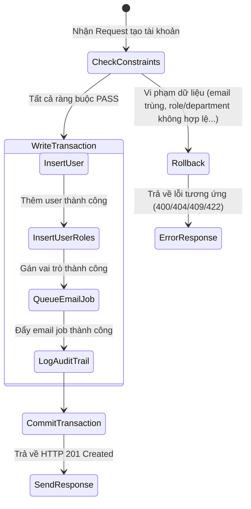

# 📝 CHANGELOG & REVISION HISTORY
| Ngày cập nhật | Tóm tắt thay đổi | Các dòng thay đổi |
| :--- | :--- | :--- |
| 2026-06-04 | Khởi tạo tài liệu tác động mô hình dữ liệu (data-model.md) cho tính năng Tạo tài khoản thủ công | Toàn bộ tài liệu |

# Data Model Impact & Schema Details

## 1. Entities & Fields Definition

Tính năng này tương tác trực tiếp với các bảng sau trong hệ thống **Database v3.2 Compact** (39 bảng):

### 1.1 Bảng `users` (Đọc/Ghi)
Chèn một bản ghi mới đại diện cho nhân viên được tạo.

| Cột DB | Thuộc tính Entity | Kiểu dữ liệu | Ràng buộc | Giá trị khi tạo | Ghi chú |
|---|---|---|---|---|---|
| `id` | `id` | UUID | Primary Key, Default: `gen_random_uuid()` | Tự động sinh | Khóa chính |
| `employee_code` | `employeeCode` | varchar(50) | Nullable, Unique | Cung cấp từ request hoặc `null` | Mã nhân viên (optional) |
| `username` | `username` | varchar(100) | Unique | `lower(email)` | Tên đăng nhập |
| `email` | `email` | varchar(255) | Unique | `lower(trim(email))` | Email định danh |
| `password_hash` | `passwordHash` | varchar(255) | Not Null | Bcrypt hash của mật khẩu tạm thời | Mật khẩu được mã hóa |
| `full_name` | `fullName` | varchar(255) | Not Null | Cung cấp từ request | Họ và tên |
| `phone_number` | `phoneNumber` | varchar(30) | Nullable | Cung cấp từ request hoặc `null` | Định dạng validated |
| `department_id` | `departmentId` | UUID | FK -> `departments.id`, Nullable | Cung cấp từ request | Phòng ban trực thuộc |
| `direct_manager_id` | `directManagerId` | UUID | FK -> `users.id`, Nullable | Cung cấp từ request hoặc `null` | Người quản lý trực tiếp |
| `position_title` | `positionTitle` | varchar(150) | Nullable | Cung cấp từ request hoặc `null` | Chức danh công việc |
| `employment_status`| `employmentStatus`| varchar(30) | Default: `'active'` | `'active'` | Trạng thái công việc |
| `account_status` | `accountStatus` | varchar(30) | Default: `'active'` | `'active'` | Trạng thái tài khoản |
| `must_change_password`| `mustChangePassword`| boolean | Default: `false` | `true` | Bắt buộc đổi mật khẩu ở lần đăng nhập đầu tiên |
| `created_by` | - (Không có cột) | UUID | Nullable | ID người tạo (từ JWT sub) | Ghi nhận tài khoản Manager thực hiện |
| `created_at` | `createdAt` | timestamptz | Default: `now()` | Tự động sinh | Thời gian tạo |
| `updated_at` | `updatedAt` | timestamptz | Default: `now()` | Tự động sinh | Thời gian cập nhật |
| `deleted_at` | `deletedAt` | timestamptz | Nullable | `null` | Soft delete support |

### 1.2 Bảng `user_roles` (Ghi)
Chèn $N$ bản ghi để liên kết người dùng mới với các vai trò được chọn.

| Cột DB | Thuộc tính Entity | Kiểu dữ liệu | Ràng buộc | Giá trị khi tạo | Ghi chú |
|---|---|---|---|---|---|
| `id` | `id` | UUID | Primary Key, Default: `gen_random_uuid()` | Tự động sinh | Khóa chính |
| `user_id` | `userId` | UUID | FK -> `users.id`, Cascade Delete | ID user vừa tạo | Liên kết user |
| `role_id` | `roleId` | UUID | FK -> `roles.id`, Cascade Delete | roleId lấy từ danh sách | Liên kết role |
| `assigned_by` | `assignedBy` | UUID | FK -> `users.id`, Nullable | ID người tạo (từ JWT sub) | Người gán role |
| `assigned_at` | `assignedAt` | timestamptz | Default: `now()` | Tự động sinh | Thời gian gán |
| `is_active` | `isActive` | boolean | Default: `true` | `true` | Trạng thái liên kết |

### 1.3 Bảng `background_jobs` (Ghi)
Chèn 1 bản ghi dạng queue gửi email.

| Cột DB | Thuộc tính Entity | Kiểu dữ liệu | Ràng buộc | Giá trị khi tạo | Ghi chú |
|---|---|---|---|---|---|
| `id` | `id` | UUID | Primary Key, Default: `gen_random_uuid()` | Tự động sinh | Khóa chính |
| `job_type` | `jobType` | varchar(80) | Not Null | `'send_email'` | Loại background job |
| `related_entity_type`| `relatedEntityType`| varchar(60)| Nullable | `'users'` | Entity liên quan |
| `related_entity_id`| `relatedEntityId`| UUID | Nullable | ID user vừa tạo | ID entity liên quan |
| `requested_by` | `requestedBy` | UUID | FK -> `users.id`, Nullable | ID người tạo (từ JWT sub) | Người tạo request |
| `status` | `status` | varchar(30) | Default: `'queued'` | `'queued'` | Trạng thái job |
| `input_json` | `inputJson` | jsonb | Nullable | Email payload chứa tên, email, mật khẩu tạm | Cực kỳ quan trọng để gửi email |
| `priority` | `priority` | integer | Default: `0` | `0` | Mức độ ưu tiên |
| `retry_count` | `retryCount` | integer | Default: `0` | `0` | Số lần thử lại |

### 1.4 Bảng `audit_logs` (Ghi)
Chèn 1 bản ghi để ghi nhận hoạt động.

| Cột DB | Thuộc tính Entity | Kiểu dữ liệu | Ràng buộc | Giá trị khi tạo | Ghi chú |
|---|---|---|---|---|---|
| `id` | `id` | UUID | Primary Key, Default: `gen_random_uuid()` | Tự động sinh | Khóa chính |
| `user_id` | `userId` | UUID | FK -> `users.id`, Nullable | ID người tạo (từ JWT sub) | Người thực hiện |
| `action_type` | `actionType` | varchar(80) | Not Null | `'ACCOUNT_CREATE'` | Hành động |
| `entity_type` | `entityType` | varchar(80) | Not Null | `'users'` | Loại đối tượng chịu tác động |
| `entity_id` | `entityId` | UUID | Nullable | ID user vừa tạo | ID đối tượng chịu tác động |
| `new_value_json` | `newValueJson` | jsonb | Nullable | JSON chứa thông tin user mới tạo | KHÔNG bao gồm password_hash/temporaryPassword |
| `severity` | `severity` | varchar(20) | Default: `'info'` | `'info'` | Mức độ nghiêm trọng |
| `ip_address` | `ipAddress` | varchar(100) | Nullable | IP từ request header | IP người gọi |
| `user_agent` | `userAgent` | text | Nullable | User-Agent từ header | Trình duyệt/Thiết bị |
| `request_id` | `requestId` | varchar(120) | Nullable | Request-ID từ header | ID yêu cầu để tracing |

---

## 2. SQL Queries & State Transitions

### 2.1 Các câu truy vấn kiểm tra dữ liệu đầu vào (Read-only Checks)
Để đảm bảo các ràng buộc nghiệp vụ, hệ thống thực hiện các câu SELECT kiểm tra trước khi insert:
1. **Kiểm tra Email đã tồn tại**:
   ```sql
   SELECT id FROM users WHERE email = lower(trim($1)) AND deleted_at IS NULL;
   ```
2. **Kiểm tra Username đã tồn tại**:
   ```sql
   SELECT id FROM users WHERE username = lower(trim($1)) AND deleted_at IS NULL;
   ```
3. **Kiểm tra Department tồn tại và hoạt động**:
   ```sql
   SELECT id, is_active FROM departments WHERE id = $1 AND deleted_at IS NULL;
   ```
4. **Kiểm tra các Roles tồn tại và hoạt động**:
   ```sql
   SELECT id, is_active FROM roles WHERE id ANY($1);
   ```
5. **Kiểm tra Employee Code trùng lặp** (nếu có cung cấp):
   ```sql
   SELECT id FROM users WHERE employee_code = trim($1) AND deleted_at IS NULL;
   ```
6. **Kiểm tra Direct Manager tồn tại và hoạt động** (nếu có cung cấp):
   ```sql
   SELECT id, account_status, employment_status FROM users WHERE id = $1 AND deleted_at IS NULL;
   ```

### 2.2 Luồng thay đổi trạng thái hệ thống (State Transitions)
Khi thực hiện tạo tài khoản, các thay đổi trạng thái sau xảy ra đồng thời trong một giao dịch cơ sở dữ liệu:


- Trạng thái ban đầu của user mới: `account_status = 'active'`, `employment_status = 'active'`, `must_change_password = true`.
- Job trong hàng đợi `background_jobs` có trạng thái ban đầu: `status = 'queued'`.
