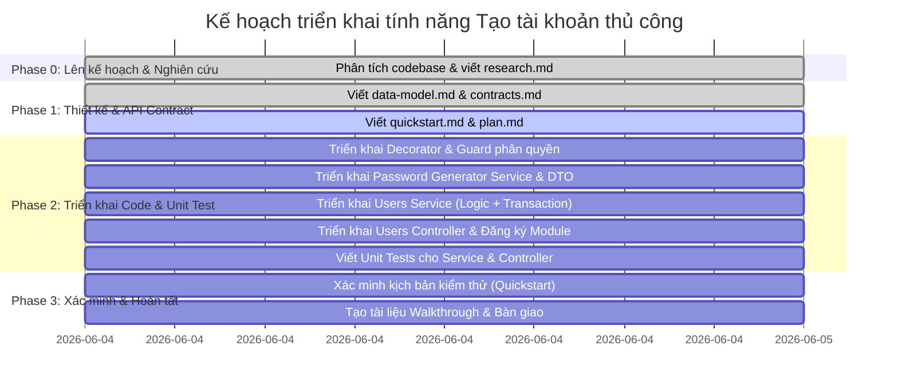

# 📝 CHANGELOG & REVISION HISTORY
| Ngày cập nhật | Tóm tắt thay đổi | Các dòng thay đổi |
| :--- | :--- | :--- |
| 2026-06-04 | Khởi tạo kế hoạch triển khai (plan.md) cho tính năng Tạo tài khoản thủ công | Toàn bộ tài liệu |

# Implementation Plan: UC-06 — Tạo tài khoản thủ công (Manual Employee Account)

**Branch**: `tai-branch` | **Date**: 2026-06-04 | **Spec**: [spec.md](file:///d:/FPT/Capstone/capstone-be/spec/features/account/manual-employee-account/spec.md)
**Input**: Feature specification from `spec/features/account/manual-employee-account/spec.md`

---

## 1. Feature Summary

Tính năng **Tạo tài khoản thủ công** cho phép người quản trị (Manager/Admin) có quyền hạn phù hợp thực hiện đăng ký thông tin nhân viên mới trong hệ thống. Hệ thống tự động sinh một mật khẩu tạm thời an toàn, mã hóa mật khẩu bằng `bcrypt`, tạo tài khoản ở trạng thái hoạt động nhưng bắt buộc đổi mật khẩu ở lần đăng nhập đầu tiên. Đồng thời, hệ thống xếp hàng một tác vụ nền để gửi email thông tin đăng nhập đến cho nhân viên và ghi nhật ký hoạt động (audit log) phục vụ cho việc giám sát, truy vết. 

Toàn bộ các bước: Tạo tài khoản, Gán vai trò, Đẩy email job vào hàng đợi và Ghi audit log được thực hiện trong một giao dịch cơ sở dữ liệu duy nhất (Single Database Transaction) nhằm bảo đảm tính toàn vẹn dữ liệu (Atomicity).

---

## 2. Technical Context

- **Language/Version**: Node.js v20 LTS, TypeScript v5.x
- **Primary Dependencies**: NestJS v10.x, TypeORM v10.x (PostgreSQL driver), `@nestjs/jwt`, `class-validator`, `class-transformer`, `bcrypt`
- **Storage**: PostgreSQL (Database v3.2 Compact - 39 bảng)
- **Testing**: Jest (Unit testing & Integration testing)
- **Target Platform**: Node.js Runtime (Linux / Windows Environment)
- **Project Type**: Web Service API (NestJS Modular Monolith)
- **Performance Goals**: API response time < 500ms dưới tải thông thường (chỉ bao gồm DB transaction, không gửi SMTP trực tiếp).
- **Constraints**: 
  - Mật khẩu tạm thời không được lưu raw ở bất cứ đâu (database, log, console).
  - Không nợ kỹ thuật (technical debt), strict typing, validate toàn bộ input ở tầng DTO.
  - Phục vụ đúng ranh giới module (Module Boundary): logic tạo tài khoản nằm trọn vẹn trong module `accounts`.

---

## 3. Scope Confirmation

### In-Scope (Trong phạm vi triển khai)
- Tạo tài khoản nhân viên đơn lẻ bằng cách nhập thủ công các trường: `fullName`, `email`, `departmentId`, `roleIds`, `employeeCode` (optional), `phoneNumber` (optional), `positionTitle` (optional), `directManagerId` (optional).
- Tự sinh mật khẩu tạm thời có độ dài $\ge 12$ ký tự, đáp ứng chính sách bảo mật tối thiểu 1 ký tự hoa, 1 ký tự thường, 1 số, 1 ký tự đặc biệt.
- Tự động thiết lập: `username = lower(email)`, `accountStatus = 'active'`, `employmentStatus = 'active'`, `mustChangePassword = true`.
- Giao dịch cơ sở dữ liệu (Transaction boundary): User + Roles + Background Job Email + Audit Log.
- Viết bộ xác thực phân quyền dùng chung: Decorator `@RequirePermissions()` và guard `PermissionsGuard` (áp dụng phân quyền `account.user.create`).
- Định dạng Email credential payload lưu trữ tại `background_jobs.input_json` (chứa họ tên, email đăng nhập, mật khẩu tạm, thông báo bảo mật).

### Out-of-Scope (Ngoài phạm vi triển khai)
- Không import Excel hoặc bulk account creation.
- Không có chức năng cập nhật, xóa, vô hiệu hóa tài khoản (CRUD users đầy đủ).
- Không tự gửi email thông qua SMTP server trực tiếp trong request handler (async-only qua background job).
- Không tạo bảng mới, không chỉnh sửa kiểu dữ liệu hoặc cấu trúc cột của Database v3.2 Compact.
- Không tích hợp AI, Vector database, hay RAG pipeline.

---

## 4. Data Model Impact

Sử dụng trực tiếp các bảng hiện có trong database, tác động cụ thể như sau:
1. **`users` (INSERT)**: Tạo bản ghi nhân viên mới. Cột `password_hash` lưu bcrypt hash của mật khẩu tạm. `must_change_password` thiết lập là `true`.
2. **`user_roles` (INSERT)**: Gán các quyền tương ứng thông qua trung gian với `assigned_by` lấy từ JWT sub.
3. **`background_jobs` (INSERT)**: Xếp hàng job loại `'send_email'` kèm theo thông tin đăng nhập trong `input_json`.
4. **`audit_logs` (INSERT)**: Ghi lại vết tạo tài khoản với `action_type = 'ACCOUNT_CREATE'`, `entity_type = 'users'`, tuyệt đối không log password/hash trong `new_value_json`.

---

## 5. API / Contract Plan

Đặc tả API chi tiết được triển khai tại: [manual-employee-account-api.md](file:///d:/FPT/Capstone/capstone-be/spec/features/account/manual-employee-account/contracts/manual-employee-account-api.md)
- **Method**: `POST`
- **Path**: `/api/v1/users`
- **Request DTO**: `CreateUserDto` với các quy tắc kiểm thực (class-validator).
- **Response DTO**: Trả về 201 Created kèm dữ liệu user an toàn (`id`, `email`, `fullName`, `employeeCode`, `accountStatus`, `mustChangePassword`, `roles`, `createdAt`).

---

## 6. Authorization Plan

- Sử dụng cơ chế phân quyền dựa trên vai trò (RBAC) thông qua mã định danh quyền hạn trong DB.
- Cài đặt decorator `@RequirePermissions('account.user.create')` trên controller endpoint.
- Triển khai `PermissionsGuard` để kiểm tra quyền hạn của người dùng sau khi `JwtAuthGuard` đã giải mã thành công token:
  1. Guard lấy `userId` từ `request.user.userId`.
  2. Gọi `AuthzReadRepository.getEffectiveRolesAndPermissions(userId)` để lấy danh sách quyền hạn thực tế của Manager.
  3. So khớp danh sách quyền hạn thực tế với quyền hạn yêu cầu (`account.user.create`). Nếu không đủ quyền, ném `ForbiddenException` (HTTP 403).

---

## 7. Business Logic Plan

### 7.1 Mật khẩu tạm thời và Mã hóa
- Sử dụng thư viện `crypto` của Node.js để sinh chuỗi ngẫu nhiên CSPRNG có độ dài 12 ký tự đảm bảo chính sách mật khẩu.
- Mã hóa mật khẩu tạm bằng `bcrypt` với cost factor là 10 để lưu trữ vào trường `users.password_hash`.

### 7.2 Ranh giới Transaction (Database Transaction Boundary)
- Sử dụng `this.dataSource.transaction` để bọc các tác vụ ghi DB:
  - B1: Tạo user trong bảng `users` (nếu email/username hoặc employee_code đã tồn tại, DB sẽ báo lỗi vi phạm ràng buộc duy nhất và tự động rollback).
  - B2: Tạo các bản ghi gán vai trò trong bảng `user_roles`.
  - B3: Tạo bản ghi job gửi email trong bảng `background_jobs` với thông tin mật khẩu tạm dạng raw để email worker có thể đọc và gửi.
  - B4: Tạo bản ghi log hoạt động trong bảng `audit_logs`.
- Tác vụ ghi Audit Log (`audit_logs`) được thiết kế dạng non-blocking bên trong transaction bằng cách bọc khối lệnh chèn DB bằng `try-catch`. Nếu có lỗi xảy ra khi ghi log (ví dụ: DB audit đầy hoặc timeout), hệ thống ghi log lỗi lên console nhưng không rethrow lỗi, đảm bảo transaction chính của user vẫn được commit bình thường.
- Nếu B1, B2 hoặc B3 thất bại, transaction sẽ rollback toàn bộ. Không có user hay job nào được sinh ra.

---

## 8. Validation Plan

Sử dụng `class-validator` để validate dữ liệu đầu vào tại DTO:
- `fullName`: `@IsNotEmpty()`, `@IsString()`, `@MaxLength(255)`.
- `email`: `@IsNotEmpty()`, `@IsEmail()`, `@MaxLength(255)`.
- `departmentId`: `@IsNotEmpty()`, `@IsUUID()`.
- `roleIds`: `@IsArray()`, `@ArrayNotEmpty()`, `@IsUUID('4', { each: true })`.
- `employeeCode`: `@IsOptional()`, `@IsString()`, `@MaxLength(50)`.
- `phoneNumber`: `@IsOptional()`, `@IsString()`, `@MaxLength(30)`. Định dạng được kiểm thực qua regex: cho phép chữ số, dấu cách, `+`, `-`, `(`, `)`.
- `positionTitle`: `@IsOptional()`, `@IsString()`, `@MaxLength(150)`.
- `directManagerId`: `@IsOptional()`, `@IsUUID()`.

*Xử lý tiền dữ liệu (Normalization)*:
- Email trước khi đi vào validation sẽ được xử lý trim khoảng trắng hai đầu và chuyển hoàn toàn thành chữ thường (lowercase) bằng custom transformer hoặc xử lý logic đầu hàm dịch vụ.

---

## 9. Error Handling Plan

Map các lỗi hệ thống và vi phạm ràng buộc nghiệp vụ thành các HTTP Exception tương ứng:
- Lỗi cú pháp/DTO validation $\rightarrow$ `BadRequestException` (HTTP 400, `VALIDATION_ERROR`).
- Thiếu JWT token / Hết hạn $\rightarrow$ `UnauthorizedException` (HTTP 401, `UNAUTHORIZED`).
- Thiếu quyền `account.user.create` $\rightarrow$ `ForbiddenException` (HTTP 403, `FORBIDDEN`).
- Trùng email/username $\rightarrow$ `ConflictException` (HTTP 409, `ACCOUNT_EMAIL_ALREADY_EXISTS` / `ACCOUNT_USERNAME_ALREADY_EXISTS`).
- Trùng mã nhân viên `employeeCode` $\rightarrow$ `ConflictException` (HTTP 409, `ACCOUNT_EMPLOYEE_CODE_ALREADY_EXISTS`).
- Department không tồn tại $\rightarrow$ `NotFoundException` (HTTP 404, `DEPARTMENT_NOT_FOUND`).
- Department bị vô hiệu hóa hoặc đã xóa mềm $\rightarrow$ `UnprocessableEntityException` (HTTP 422, `DEPARTMENT_INACTIVE_OR_DELETED`).
- Role không tồn tại $\rightarrow$ `NotFoundException` (HTTP 404, `ROLE_NOT_FOUND`).
- Role bị vô hiệu hóa $\rightarrow$ `UnprocessableEntityException` (HTTP 422, `ROLE_INACTIVE`).
- Danh sách role trống $\rightarrow$ `UnprocessableEntityException` (HTTP 422, `ROLE_IDS_EMPTY`).
- Người quản lý trực tiếp không tồn tại $\rightarrow$ `NotFoundException` (HTTP 404, `MANAGER_NOT_FOUND`).
- Người quản lý trực tiếp bị vô hiệu hóa / đã nghỉ việc $\rightarrow$ `UnprocessableEntityException` (HTTP 422, `MANAGER_INACTIVE_OR_UNAVAILABLE`).
- Lỗi ghi job email nền / Lỗi hệ thống khác $\rightarrow$ `InternalServerErrorException` (HTTP 500, `INTERNAL_SERVER_ERROR`).

---

## 10. Testing Strategy

Thực hiện viết đầy đủ unit test cho `UsersService` và `UsersController` với Jest, đảm bảo độ bao phủ (coverage) mã nguồn cao cho tất cả các kịch bản thành công và thất bại:
- **Service Unit Tests** (`users.service.spec.ts`):
  - Mock `DataSource`, `EntityManager` và các Repository liên quan.
  - Test Happy Path: tạo tài khoản thành công, sinh mật khẩu tạm hợp lệ, xếp email job và ghi log.
  - Test Error Cases: trùng email, trùng employeeCode, department không tồn tại/inactive, manager không hoạt động, role không tồn tại/inactive.
  - Test transaction rollback: giả lập lỗi chèn background job, đảm bảo transaction ném lỗi và rollback.
- **Controller Unit Tests** (`users.controller.spec.ts`):
  - Mock service và xác minh các giá trị đầu ra trả về cấu trúc response chuẩn.
  - Test validation đầu vào (E1 errors).
- **Integration Tests / E2E Tests** (nếu có khung kiểm thử chung):
  - Thực hiện gọi API thật qua `supertest`, kiểm thử việc từ chối khi thiếu JWT hoặc sai quyền hạn.

---

## 11. Constitution Check

*GATE: Must pass before Phase 0 research. Re-check after Phase 1 design.*

| Principle / Gate | Status | Justification / Detail |
|---|---|---|
| **I. Database Integrity** | **PASS** | Không thêm bảng mới, không thêm cột mới. Sử dụng đúng schema database v3.2 Compact. |
| **II. Security-First** | **PASS** | Mật khẩu được mã hóa bằng bcrypt trước khi lưu DB. Không trả mật khẩu tạm hay hash về API response. Ghi log không chứa thông tin credential. |
| **III. No Scope Creep** | **PASS** | Chỉ thực hiện tạo tài khoản thủ công theo đúng đặc tả UC-06. Không làm thêm import excel hay CRUD đầy đủ. |
| **IV. Module Boundary** | **PASS** | Toàn bộ logic nghiệp vụ nằm trọn vẹn trong module `accounts`. |
| **V. API Consistency** | **PASS** | Kế hoạch API sử dụng prefix `/api/v1` và tuân thủ chặt chẽ cấu trúc JSON response chuẩn. |
| **VI. Authentication Architecture** | **PASS** | Sử dụng JWT Bearer Token để xác thực qua `JwtAuthGuard`. |
| **VII. TypeScript Strict** | **PASS** | Áp dụng strict typing và kiểm thực dữ liệu qua ValidationPipe. |

---

## 12. Project Structure

Tổ chức các file liên quan đến tính năng trong codebase như sau:

```text
src/modules/accounts/
├── accounts.module.ts             # Cập nhật imports/controllers/providers
├── controllers/
│   └── users.controller.ts        # [NEW] Controller nhận request API tạo tài khoản
├── services/
│   ├── users.service.ts           # [NEW] Service xử lý business logic và transaction
│   └── password-generator.service.ts # [NEW] Utility sinh mật khẩu tạm ngẫu nhiên CSPRNG
├── dto/
│   ├── create-user.dto.ts         # [NEW] Request DTO validate dữ liệu đầu vào
│   └── user-response.dto.ts       # [NEW] Response DTO định nghĩa đầu ra an toàn
└── tests/
    ├── users.controller.spec.ts   # [NEW] Unit test cho controller
    ├── users.service.spec.ts      # [NEW] Unit test cho service
    └── password-generator.service.spec.ts # [NEW] Unit test cho bộ sinh mật khẩu
```

Và các file chia sẻ về xác thực quyền hạn:
```text
src/modules/auth/
├── decorators/
│   └── require-permissions.decorator.ts # [NEW] Decorator định nghĩa danh sách quyền yêu cầu
└── guards/
    └── permissions.guard.ts             # [NEW] Guard kiểm tra quyền hạn dựa trên AuthzReadRepository
```

---

## 13. Complexity Tracking

*Không có vi phạm nguyên tắc thiết kế nào cần ghi nhận.*

| Violation | Why Needed | Simpler Alternative Rejected Because |
|---|---|---|
| *None* | *N/A* | *N/A* |

---

## 14. Implementation Phases



---

## 15. Risks & Mitigations (Chi tiết rủi ro & Giải pháp)

1. **Rủi ro: Race Condition khi tạo tài khoản đồng thời**
   - *Chi tiết*: Hai Admin tạo cùng lúc tài khoản với cùng một Email, tại thời điểm kiểm tra SELECT đều báo chưa tồn tại, nhưng khi INSERT vào DB thì gây ra lỗi vi phạm Unique Constraint.
   - *Giải pháp*: Bắt lỗi `QueryFailedError` từ TypeORM khi insert, kiểm tra mã lỗi vi phạm khóa duy nhất (PostgreSQL code `23505`). Nếu trùng email/username, ném lỗi 409 `ACCOUNT_EMAIL_ALREADY_EXISTS` / `ACCOUNT_USERNAME_ALREADY_EXISTS`. Nếu trùng mã nhân viên, ném lỗi 409 `ACCOUNT_EMPLOYEE_CODE_ALREADY_EXISTS`.
2. **Rủi ro: Lỗi khi đẩy Job gửi email làm mất thông tin tài khoản**
   - *Chi tiết*: Tài khoản được tạo nhưng DB Background Job bị lỗi, dẫn đến việc không ghi nhận gửi email, nhân viên không biết thông tin đăng nhập.
   - *Giải pháp*: Đưa việc tạo User, Roles và Background Job vào cùng một transaction duy nhất. Bất kỳ bước nào lỗi đều rollback toàn bộ. Không gọi SMTP trực tiếp để tránh treo transaction.
3. **Rủi ro: Rò rỉ thông tin mật khẩu tạm thời**
   - *Chi tiết*: Mật khẩu tạm thời vô tình bị in ra console log của NestJS, ghi vào audit_logs dưới dạng text, hoặc gửi về API response.
   - *Giải pháp*: Thiết lập trường `passwordHash` trong `UserEntity` có thuộc tính `select: false`. DTO response loại bỏ hoàn toàn mật khẩu tạm. Trong hàm chèn log và audit log, kiểm tra kỹ lưỡng chỉ ghi nhận các siêu dữ liệu (metadata) an toàn.

---

## 16. Acceptance Criteria Traceability

| Mã AC | Yêu cầu Nghiệp vụ (Requirement ID) | Kịch bản kiểm thử tương ứng (Test Scenario) | Vị trí kiểm chứng |
|---|---|---|---|
| **AC-001** | FR-ACCT-010..018 (Happy path) | Happy Path Scenario (1.1) | `users.service.spec.ts` & DB Verification |
| **AC-002** | FR-ACCT-017 (Username = lower(email)) | Happy Path Scenario (1.1) | `users.service.spec.ts` & DB Verification |
| **AC-003** | FR-ACCT-029, ERR-ACCT-001 (Thiếu fullName) | TS-02: Sai Định Dạng Dữ Liệu | `users.controller.spec.ts` |
| **AC-004** | FR-ACCT-030, ERR-ACCT-002 (Email invalid) | TS-02: Sai Định Dạng Dữ Liệu | `users.controller.spec.ts` |
| **AC-005** | FR-ACCT-036, ERR-ACCT-004 (Empty roleIds) | TS-03: Rỗng Danh Sách Vai Trò | `users.service.spec.ts` / DTO validator |
| **AC-006** | FR-ACCT-040, ERR-ACCT-008 (Phone invalid) | TS-02: Sai Định Dạng Dữ Liệu | `users.controller.spec.ts` |
| **AC-007** | FR-ACCT-027, ERR-ACCT-009 (Thiếu JWT) | TS-01: Thiếu Quyền Hạn | Integration tests |
| **AC-008** | FR-ACCT-028, ERR-ACCT-010 (Thiếu Permission) | TS-01: Thiếu Quyền Hạn | Integration tests / Guard tests |
| **AC-009** | FR-ACCT-031, ERR-ACCT-011 (Trùng email) | TS-06: Trùng Lặp Email | `users.service.spec.ts` |
| **AC-010** | FR-ACCT-031 (Trùng email case-insensitive) | TS-06: Trùng Lặp Email | `users.service.spec.ts` |
| **AC-011** | FR-ACCT-031, NFR-ACCT-010 (Race condition DB) | TS-06: Trùng Lặp Email | `users.service.spec.ts` |
| **AC-012** | FR-ACCT-032, ERR-ACCT-012 (Dept not found) | TS-04: Phòng Ban Không Hợp Lệ | `users.service.spec.ts` |
| **AC-013** | FR-ACCT-033, ERR-ACCT-013 (Dept inactive) | TS-04: Phòng Ban Không Hợp Lệ | `users.service.spec.ts` |
| **AC-014** | FR-ACCT-034, ERR-ACCT-014 (Role not found) | TS-05: Vai Trò Không Hợp Lệ | `users.service.spec.ts` |
| **AC-015** | FR-ACCT-035, ERR-ACCT-015 (Role inactive) | TS-05: Vai Trò Không Hợp Lệ | `users.service.spec.ts` |
| **AC-016** | FR-ACCT-039, ERR-ACCT-016 (Mã NV trùng) | TS-07: Trùng Lặp Mã Nhân Viên | `users.service.spec.ts` |
| **AC-017** | FR-ACCT-041, ERR-ACCT-017 (Username trùng) | TS-06: Trùng Lặp Email | `users.service.spec.ts` |
| **AC-018** | FR-ACCT-024, ERR-ACCT-018 (Manager not found) | TS-04: Phòng Ban Không Hợp Lệ | `users.service.spec.ts` |
| **AC-019** | FR-ACCT-022, ERR-ACCT-019 (Manager inactive) | TS-04: Phòng Ban Không Hợp Lệ | `users.service.spec.ts` |
| **AC-020** | FR-ACCT-037, FR-ACCT-042 (Rollback job fail) | TS-08: Lỗi Tạo Background Job | `users.service.spec.ts` |
| **AC-021** | FR-ACCT-050, 052 (Audit log ghi nhận) | Happy Path Scenario (1.1) | `users.service.spec.ts` & DB Verification |
| **AC-022** | FR-ACCT-007, NFR-ACCT-005 (Response an toàn) | TS-02: Dữ liệu đầu ra an toàn | `users.controller.spec.ts` |
