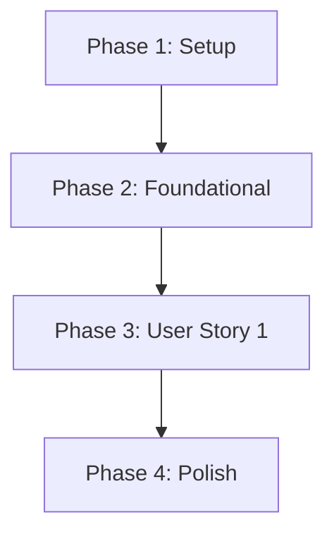

# 📝 CHANGELOG & REVISION HISTORY
| Ngày cập nhật | Tóm tắt thay đổi | Các dòng thay đổi |
| :--- | :--- | :--- |
| 2026-06-04 | Khởi tạo tài liệu danh sách công việc (tasks.md) cho tính năng Tạo tài khoản thủ công | Toàn bộ tài liệu |
| 2026-06-04 | Cập nhật danh sách công việc dựa trên báo cáo phân tích đối soát chất lượng (speckit-analyze) | Bổ sung T003, T008, sửa đánh số và Requirements Coverage |
| 2026-06-04 | Đánh dấu hoàn thành T015, T016 và cập nhật cấu hình Jest | Dòng 5-6, Dòng 67-68 |
| 2026-06-04 | Đánh dấu hoàn thành toàn bộ các task (T017, T018) và hoàn tất checklist | Dòng 6-7, Dòng 75-76 |

# Tasks: UC-06 — Tạo tài khoản thủ công (Manual Employee Account)

**Input**: Design documents from `spec/features/account/manual-employee-account/`
**Prerequisites**: plan.md (required), spec.md (required for user stories), research.md, data-model.md, contracts/

---

## 1. Format: `[ID] [P?] [Story] Description`

- **`- [ ]`**: Checkbox thể hiện trạng thái chưa hoàn thành
- **`TXXX`**: ID tuần tự của task
- **`[P]`**: Task có thể chạy song song (các file khác nhau, không phụ thuộc chéo vào tác vụ chưa hoàn thành)
- **`[US1]`**: Gán nhãn cho User Story 1 (không gắn nhãn cho Setup, Foundational, Polish)
- Mô tả công việc phải kèm theo đường dẫn file cụ thể

---

## 2. Path Conventions

- Tên thư mục và cấu trúc file áp dụng cho cấu trúc NestJS hiện có:
  - Cấu trúc module accounts: `src/modules/accounts/`
  - Cấu trúc module auth: `src/modules/auth/`
  - Thư mục kiểm thử: `src/modules/accounts/tests/`, `src/modules/auth/tests/`

---

## 3. Implementation Checklist

### Phase 1: Setup (Shared Infrastructure)
**Goal**: Khởi tạo cấu trúc và chuẩn bị liên kết các module cùng các lớp đối tượng mới.

- [x] T001 Khởi tạo cấu trúc thư mục và các file trống cho dịch vụ người dùng trong `src/modules/accounts/` bao gồm: `controllers/users.controller.ts`, `services/users.service.ts`, `services/password-generator.service.ts`, `dto/create-user.dto.ts`, `dto/user-response.dto.ts`
- [x] T002 Cấu hình đăng ký `UsersController` và các Service Providers mới vào `src/modules/accounts/accounts.module.ts`
- [x] T003 Import `AdministrationModule` vào `src/modules/accounts/accounts.module.ts` để sử dụng `BackgroundJobEntity` và `AuditLogEntity` trong service của accounts

---

### Phase 2: Foundational (Blocking Prerequisites)
**Goal**: Triển khai cơ chế phân quyền RBAC và Migration cơ sở dữ liệu. Đây là các phần dùng chung chặn trước toàn bộ logic nghiệp vụ.

- [x] T004 [P] Triển khai decorator `@RequirePermissions()` tại `src/modules/auth/decorators/require-permissions.decorator.ts` để lưu danh sách các quyền hạn được yêu cầu cho reflector
- [x] T005 Triển khai `PermissionsGuard` tại `src/modules/auth/guards/permissions.guard.ts` thực hiện so khớp danh sách quyền hạn yêu cầu với quyền hạn thực tế lấy từ `AuthzReadRepository` của user
- [x] T006 [P] Triển khai unit tests cho `PermissionsGuard` tại `src/modules/auth/tests/permissions.guard.spec.ts` bao gồm các case: có quyền, thiếu quyền, và không có thông tin user trong request
- [x] T007 [P] Xuất (export) `PermissionsGuard` và `@RequirePermissions()` decorator từ module `src/modules/auth/auth.module.ts` để các module khác có thể sử dụng
- [x] T008 Tạo và chạy TypeORM Migration tại `src/database/migrations/` để thêm `UNIQUE` constraint/index cho cột `employee_code` (nullable) trong bảng `users` nhằm đảm bảo tính duy nhất ở DB level

---

### Phase 3: User Story 1 - Tạo tài khoản thủ công (Priority: P1) 🎯 MVP
**Goal**: Triển khai nghiệp vụ tạo tài khoản nhân viên đơn lẻ thủ công bởi Manager/Admin trong một giao dịch DB an toàn và đồng bộ.

**Independent Test**: Gửi request `POST /api/v1/users` chứa thông tin hợp lệ từ Manager đã đăng nhập có quyền `account.user.create`. Xác minh kết quả trả về mã HTTP 201 Created và dữ liệu người dùng không nhạy cảm. Xác thực trong database các bản ghi `users`, `user_roles`, `background_jobs` (email job) và `audit_logs` đã được tạo chính xác và đồng bộ.

#### Implementation for User Story 1
- [x] T009 [P] [US1] Triển khai bộ sinh mật khẩu tạm thời CSPRNG ngẫu nhiên trong `src/modules/accounts/services/password-generator.service.ts` đảm bảo độ dài $\ge 12$ ký tự, chứa tối thiểu 1 chữ hoa, 1 chữ thường, 1 số, 1 ký tự đặc biệt
- [x] T010 [US1] Viết unit tests cho `PasswordGeneratorService` tại `src/modules/accounts/tests/password-generator.service.spec.ts` xác thực độ dài và độ phức tạp của mật khẩu được tạo (phụ thuộc vào T009)
- [x] T011 [P] [US1] Định nghĩa `CreateUserDto` và `UserResponseDto` tại `src/modules/accounts/dto/` có tích hợp `@Trim()` (nếu có), `class-validator` cho email format, phone format, departmentId, roleIds và directManagerId
- [x] T012 [US1] Viết unit tests cho `CreateUserDto` tại `src/modules/accounts/tests/create-user.dto.spec.ts` để kiểm thực việc bắt lỗi định dạng đầu vào (phụ thuộc vào T011)
- [x] T013 [US1] Triển khai logic nghiệp vụ tạo tài khoản trong `src/modules/accounts/services/users.service.ts` bằng `this.dataSource.transaction()`. Quy trình: chuẩn hóa email (trim + lowercase), kiểm tra email/username unique, kiểm tra active department, kiểm tra các active roleIds, kiểm tra unique employeeCode (nếu có), sinh password, hash password bằng bcrypt, lưu user (`must_change_password = true`), gán roles, tạo background job gửi email, và ghi audit log hành động `ACCOUNT_CREATE` dạng try-catch (non-blocking)
- [x] T014 [US1] Viết bộ unit tests đầy đủ cho `UsersService` tại `src/modules/accounts/tests/users.service.spec.ts` mô phỏng (mock) các Repository/DataSource để kiểm tra Happy Path, toàn bộ các Error Cases và kiểm thử hành vi chặn khi mới tạo user của `MustChangePasswordGuard`
- [x] T015 [US1] Triển khai controller endpoint `POST /api/v1/users` tại `src/modules/accounts/controllers/users.controller.ts` bảo vệ bởi `@UseGuards(JwtAuthGuard, PermissionsGuard)` và gắn nhãn `@RequirePermissions('account.user.create')`
- [x] T016 [US1] Viết unit tests cho `UsersController` tại `src/modules/accounts/tests/users.controller.spec.ts` xác minh việc gọi service đúng cách và định dạng API response thành công/lỗi đồng nhất

---

### Phase 4: Polish & Cross-Cutting Concerns
**Goal**: Hoàn thiện tối ưu mã nguồn, kiểm tra định dạng và thực hiện kiểm thử tích hợp thủ công cuối cùng.

- [x] T017 [P] Thực hiện rà soát linter và formatter cho toàn bộ mã nguồn liên quan trong `src/modules/accounts/` và `src/modules/auth/`
- [x] T018 Tiến hành chạy các kịch bản kiểm thử (Happy Path và Error Cases) của tài liệu [quickstart.md](file:///d:/FPT/Capstone/capstone-be/spec/features/account/manual-employee-account/quickstart.md) trên môi trường database local để đảm bảo hệ thống tích hợp hoạt động đúng đắn

---

## 4. Dependencies & Execution Order

### Phase Dependencies


### Parallel Opportunities (Các tác vụ song song)
- Trong Phase 2, `T004`, `T006` và `T007` có thể chạy song song.
- Trong Phase 3 (US1):
  - Bộ sinh mật khẩu (`T009` và kiểm thử `T010`) và bộ xác thực DTO (`T011` và kiểm thử `T012`) hoàn toàn độc lập với nhau, có thể phát triển song song trước khi triển khai `T013` (UsersService).

---

## 5. Parallel Execution Example: User Story 1

```bash
# Nhánh công việc 1: Triển khai password generator utility
Task: "Triển khai bộ sinh mật khẩu tạm thời CSPRNG ngẫu nhiên..." (T009)

# Nhánh công việc 2 (Song song với Nhánh 1): Triển khai validation DTO
Task: "Định nghĩa CreateUserDto và UserResponseDto..." (T011)
```

---

## 6. Implementation Strategy

### MVP First (Bản tối giản trước)
1. Hoàn tất setup dự án ở Module `accounts` (Phase 1).
2. Xây dựng các lớp kiểm tra quyền hạn `@RequirePermissions`, `PermissionsGuard` và Migration tạo unique constraint (Phase 2).
3. Triển khai hoàn thiện nghiệp vụ chính (User Story 1 - Phase 3) bao gồm logic service và controller.
4. Xác minh hoạt động độc lập của API `POST /api/v1/users` bằng Postman/Swagger và SQL DB check.

---

## 7. Requirements Coverage (Bao phủ yêu cầu)

Bảng ánh xạ các tasks với các yêu cầu chức năng (FR) và tiêu chí nghiệm thu (AC) từ tài liệu `spec.md`:

| Task ID | Gắn nhãn | Requirements Covered (Mã FR/ERR) | AC Covered (Mã AC) | File ảnh hưởng chính |
|---|---|---|---|---|
| **T003** | - | - | - | `accounts.module.ts` |
| **T004** | - | FR-ACCT-002, FR-ACCT-045 | AC-008 | `require-permissions.decorator.ts` |
| **T005** | - | FR-ACCT-002, FR-ACCT-028, FR-ACCT-045 | AC-008 | `permissions.guard.ts` |
| **T006** | - | FR-ACCT-028, ERR-ACCT-010 | AC-008 | `permissions.guard.spec.ts` |
| **T008** | - | FR-ACCT-023, FR-ACCT-039 | AC-016 | `src/database/migrations/` |
| **T009** | `[US1]` | FR-ACCT-013, FR-ACCT-015 | AC-001 | `password-generator.service.ts` |
| **T010** | `[US1]` | FR-ACCT-013 | AC-001 | `password-generator.service.spec.ts` |
| **T011** | `[US1]` | FR-ACCT-017, FR-ACCT-018, FR-ACCT-023..026 | AC-001..AC-006 | `create-user.dto.ts`, `user-response.dto.ts` |
| **T012** | `[US1]` | FR-ACCT-029, ERR-ACCT-001..008 | AC-003..AC-006 | `create-user.dto.spec.ts` |
| **T013** | `[US1]` | FR-ACCT-003..006, FR-ACCT-009..012, FR-ACCT-014..018, FR-ACCT-020..022, FR-ACCT-031..039, FR-ACCT-041..043, FR-ACCT-047..054 | AC-001, AC-002, AC-009..AC-021 | `users.service.ts` |
| **T014** | `[US1]` | ERR-ACCT-011..020, FR-ACCT-042, FR-ACCT-019 | AC-009..AC-021 | `users.service.spec.ts` |
| **T015** | `[US1]` | FR-ACCT-001, FR-ACCT-007, FR-ACCT-008, FR-ACCT-010, FR-ACCT-027, FR-ACCT-044, FR-ACCT-046 | AC-001, AC-007, AC-008, AC-022 | `users.controller.ts` |
| **T016** | `[US1]` | FR-ACCT-007, FR-ACCT-027, ERR-ACCT-009 | AC-007, AC-022 | `users.controller.spec.ts` |
| **T018** | - | Toàn bộ requirements | Toàn bộ AC | Database Local / API Client |
